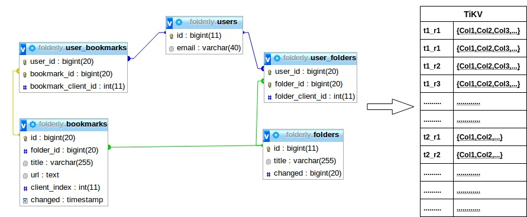
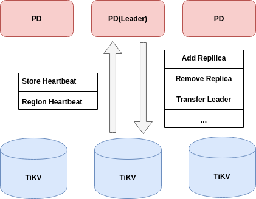

# Introduction

**TiDB ("Ti" is titanium) is an open-source NewSQL database that supports Hybrid Transactional and Analytical Processing (HTAP) workloads. SQL above NoSQL**

Feature:

 * MySQL compatible
 * **High availability**
 * **horizontal scalability**
 * Distributed transaction
 * One-stop HTAP solution

# TiDB Cluster
 

 

## TiKV Cluter ( Storage layer)

GitRepo: https://github.com/tikv/tikv

Website: https://tikv.org/

A CNCF project 

Responsible for storing data


### TiKV : a distributed transactional key-value store.

* Data is stored as Key-Value pairs.
* Data is stored in RocksDB (as embedded Key-Valued engine) locally.
* Built in Rust programming Language
* You can use TiKV alone:
    * TiDB (MySQL)
    * TiPrometheus (Prometheus)
    * Titan (Redis)
    * Tidis (Redis)
    * Titea (Redis)
* TiKV uses the [Raft protocol](https://raft.github.io/) for replication to maintain data consistency and disaster tolerance


### Why tiKV use RockDB as underlying Key-Value engine?

* RocksDB stable
* RocksDB fast
* RocksDB easy to embedded
* RocksDB has many useful features
* RocksDB has a very active community

1 TiKV Node has 2 RocksDB instance: 1 for data another for raft log

### How data store inside tiKV


Basic unit for storing data is **Region**.
* Continuous Key-Value Pair
* Default total size of Region is 256MB (configurable)
* When Region over this size:
    * PD will split this to 2 RegionId (PD generate).
    * Each new Region will speparate in Range
* Region is a logical concept:
    * Region meta: [StartKey, EndKey) is store in PD and every TiKV node
    * All Region within TiKV instance share the same RocksDB
* Each Region is a Raft group:
    * Default 3 instance


### Use Raft protocol to replication


## TiDB: The SQL layer

Stateless SQL layer
* Client can connect to any exists tidb-server instance

Full feature SQL
* Speak MySql wire protocol
* Build from scratch
* Some feature not support, can checkout [here](https://pingcap.com/docs/stable/reference/mysql-compatibility/#unsupported-features)

### Mapping relational model to Key-Value Pair



**For a row in a table, the row data is encodeded in key-value pair with the format**:

t&#60;&#60;tableId>>_r&#60;&#60;rowId>> => [col1,col2,col3,col4]

**For a row in a table, the index data of row is encodeded this format**:

t&#60;&#60;tableId>>_i&#60;&#60;indexId>>_indexedColumnsValue => rowId

Or

t&#60;&#60;tableId>>_i&#60;&#60;indexId>>_indexedColumnsValue_rowId => nil

### What Happen when TiDB receive SQL query

```SQL
> select count(*) from t where a + b  > 5;
```


For the above example, we assume the rows with the primary key of table t are distributed in three Regions:
* Rows with the primary key in [0,100) are in Region 1.
* Rows with primary key in [100,1000) are in region 2.
* Rows with primary key in [1000,~) are in region 3.


## PD( Placement Driver)

Concept from the paper of [Spanner](https://research.google/pubs/pub39966/)

Embedded [etcd](https://etcd.io/) as metadata storage

The brain of the TiKV cluster
* Timestamp allocator
* Metadata storage (local)
* Replication scheduling

Using Raft 

### How it works?

